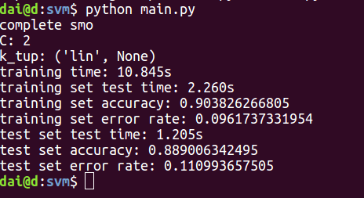

# SVM 实验
##### 代东洋 &emsp; &emsp; 计算机系

## 简介

本次实验使用SVM对手写数字进行分类。代码使用Python3,代码依赖numpy库。实验数据在digits文件夹下。

+ 涉及的算法包括：
	+ 实现简化版SMO算法
	+ 实现完整版SMO算法
	+ 对SMO加入核方法

本次实验中实现的SVM是二分类器，而手写数字分类是多分类问题（10分类）。因此，需要把多分类问题转化为二分类问题。本次实验中，实行的是 one-to-one 策略。具体而言，把10分类问题分成 $C_{10}^2 = 45$个二分类问题，训练出45个分类器。然后分别用这45个分类器对测试数据进行分类，综合这45个分类器的分类结果，属于哪个类别分类结果最多，测试数据就是哪个类。

## 算法原理

设核函数为 $K(x_i, y_i) = \phi(x_i) \cdot \phi(x_j)$，当没有使用核函数的时候，可以认为 $K(x_i, x_j) = x_i \cdot x_j$，径向基核函数为 $K(x_i, x_j) = exp(-\gamma || x_i - x_j ||^2)$。方便起见， 本文档中的公式均表示使用核函数的情况。当没有使用核函数时， $K(x_i, x_j) = x_i \cdot x_j$， 可以看作是使用核函数的一种特例。

### SVM


原最优化问题为(其中C是一个大于0的超参）

$$
\begin{align*}
\min_{w, b, \xi} \quad &\frac{1}{2}||w||^2 + C\sum_i^N\xi_i \\
s.t. \quad &y_i(w\phi(x_i) + b) \ge 1 - \xi_i\\
&\xi_i \ge 0
\end{align*}
$$

其拉格朗日对偶形式的最优化问题是

$$
\begin{align*}
\min_{a} \quad & \frac{1}{2}\sum_i^N\sum_j^Na_ia_jy_iy_jK(x_i, x_j) - \sum_i^Na_i\\
s.t. \quad & \sum_i^Na_iy_i = 0 \\
& 0 \le a_i \le C
\end{align*}
$$

原始约束问题是凸的二次规划问题，解满足KKT条件，即：

$$
\begin{align*}
& w^* - \sum_i^N a_i^*y_i \phi(x_i) = 0 \\
& \sum_i^N a_i^*y_i = 0 \\
& C - a^*_i - \mu_i^* = 0 \\
& a_i^*(y_i(w^* \phi(x_i) + b^*) - 1 + \xi^*_i) = 0 \\
& \mu_i^* \xi_i^* = 0 \\
& y_i(w^* \phi(x_i) + b^*) - 1 + \xi^*_i \ge 0 \\
& \xi_i^* \ge 0 \\
& a_i^* \ge 0 \\
& \mu_i^* \ge 0
\end{align*}
$$

假设预测函数为$h(x)$, 则 $h(x) = sign(w^* \phi(x) + b)$，令 $f(x) = w^* \phi(x) + b, h(x) = sign(f(x))$ 而
$$
\begin{align*}
& w^* =  \sum_i^N a_i^*y_i \phi(x_i) \\
\therefore \quad & f(x) = \sum_i^N a_i^*y_i \phi(x_i) \cdot \phi(x) + b \\
& f(x) = \sum_i^N a_i^* y_i K(x_i, x) + b \\
\end{align*}
$$

所以可以不用计算 $\phi(x)$也能对测试样本进行预测（只要计算 $K(x_i, x)$就可以了）。

根据上面式子，我们可以得到KKT的等价条件(只有变量$a$和$b$的情况）。

$$
\begin{align*}
a_i^* 0 & \leftrightarrow y_i f(x_i) \ge 1 \\
0 < a_i^* < C & \leftrightarrow y_i f(x_i) = 1 \\
a_i^* C & \leftrightarrow y_i f(x_i) \le 1
\end{align*}
$$

而一旦已知所有的 $a$，我们便可以根据公式 $0 < a_i^* < C  \leftrightarrow y_i f(x_i) = 1$,  $f(x_i) = \sum_j^N a_j^* y_j K(x_j, x_i) + b $ 计算出 $b$, 进而计算出 $f(x)$ 。一旦计算出 $f(x)$ 便可以对新的样本进行分类。


说明，上面所有的 $i \in {1, 2, ..., N}$,其中$N$表示训练集样本的数量。
### SMO

原问题转化为，结合KKT的等价条件，求解最优化问题：

$$
\begin{align*}
\min_{a} \quad & \frac{1}{2}\sum_i^N\sum_j^Na_ia_jy_iy_jK(x_i, x_j) - \sum_i^Na_i\\
s.t. \quad & \sum_i^Na_iy_i = 0 \\
& 0 \le a_i \le C
\end{align*}
$$

该问题由SMO算法求解。SMO算法为一种启发算法，每次迭代过程中，选择两个变量 $a_{k_1}, a_{k_2}$ 作为自由变量,假定其它变量是固定的。更改 $a_{k_1}, a_{k_2}$ 是目标函数 $ \frac{1}{2}\sum_i^N\sum_j^Na_ia_jy_iy_jK(x_i, x_j) - \sum_i^Na_i$尽可能降低。

#### SMO每一步的操作
不失一般性，我们设所选定的两个变量为$a_1, a_2$。设 $E_i = f(x_i) - y_i$ 。

由于 $ y_1 a_1 + y_2 a_2 = - \sum_{i=3}^N y_i a_i$ 为一固定的值， 当 $ a_2 $ 确定时， $ a_1 $ 也确定了。所以目标函数是关于 $a_2$ 的二次函数。假设 $L \le a_2 \le H$ 其中：

$$
\begin{align*}
if \quad & \quad y_1 == y_2: \\
& L = max(0, a_1 + a_2 -C)  \\
& H = min(C, a_1 + a_2) \\
if \quad & \quad y_1 \ne y_2: \\
& L = max(0, C + a_2 - a_1)  \\
& H = min(C, a_2 - a_1) \\
\end{align*}
$$

每次迭代过程中，新的 $a_2$ 的值在满足约束的条件下，尽可能使目标函数最小。假设迭代前后的 $a_1, a_2$ 分别为 $a_1^{old}, a_2^{old}, a_1^{new}, a_2^{new}$。 由于目标函数$ \frac{1}{2}\sum_i^N\sum_j^Na_ia_jy_iy_jK(x_i, x_j) - \sum_i^Na_i$ 是关于$a_2$的二次函数，经过一番计算后，可以得到 $a_2$ 的迭代公式如下：

$$
\begin{align*}
a_2^{unlimit} = a_2^{old} - \frac{y_2(E_1 - E_2)}{2K(x_1, x_2) - K(x_1, x_1) - K(x_2, x_2)} \\
\end{align*}
$$

$$
\begin{equation}
a_2^{new} = \left\{
\begin{array}{rl}
&H, \quad & a_2^{unlimit} > H\\
&a_2^{unlimit}, \quad &L \le a_2^{unlimit} \le H\\
&L, \quad &a_2^{unlimit} < L\\
\end{array}
\right.
\end{equation}
$$

然后按照等式 $y_1 a_1^{new} + y_2 a_2^{new} = y_1 a_1^{old} + y_2 a_2^{old} $ 更新 $a_1$。

根据条件 $0 < a_i < C  \leftrightarrow y_i f(x_i) = 1$,  $f(x_i) = \sum_j^N a_j y_j K(x_j, x_i) + b $，我们可以得到$b$的迭代公式：
$$
b_1^{new} = - E_1 - y_1K(x_1, x_2)(a_1^{new} - a_1^{old}) - y_2K(x_1, x_2)(a_2^{new} - a_2^{old}) + b^{old}
$$
或
$$
b_2^{new} = - E_2 - y_1K(x_1, x_2)(a_1^{new} - a_1^{old}) - y_2K(x_2, x_2)(a_2^{new} - a_2^{old}) + b^{old}
$$
当$a_1^{new}, a_2^{new}$ 都满足 $0 < a_i < C $ 时， $b_1^{new} = b_2^{new}$, 令$ b^{new} = b_1^{new}$。

当$a_1^{new}, a_2^{new}$ 中只有一个 $a_k， k = 1 , 2$满足 $0 < a_i < C $ 时， 令 $b^{new} = b_k^{new}$。

当$a_1^{new}, a_2^{new}$ 都不满足$0 < a_i < C $时， 令 $b^{new} = \frac{b_1^{new} + b_2^{new}}{2}$。

另外值得注意的是，公式可能出现 $ 2K(x_1, x_2) - K(x_1, x_1) - K(x_2, x_2)$  为0的情况，这种情况下，$a_2$的迭代公式无意义，这时我们不更新变量，直接进入下一步迭代。

以上SMO算法中每一步的操作。

#### 选择自由变量 $a_{k_1}, a_{k_2}$
SMO算法每次选取两个变量 $a_{k_1}, a_{k_2}$ 作为自有变量，假定其他变量为固定的，迭代变量 $a_{k_1}, a_{k_2}$ 。选取变量的过程分为两个循环，外循环和内循环。外循环选取第一个变量 $a_{k_1$， 内循环选取第二个变量 $a_{k_2}$。按照选取变量的策略不同，SMO算法分为简单版SMO算法和完整版SMO算法。

##### 简单版SMO算法
简单版SMO算法， 外循环从所有的 $a$ 的序列 $\{a_1, a_2, ..., a_N\}$ 中依次选出一个变量，作为 $a_{k_1}$。内循环中随机选择一个不是$a_{k_1}$的变量作为$a_{k_2}$。循环的停止条件为外循环$a_{k_1}$ 把序列  $\{a_1, a_2, ..., a_N\}$ 从头到尾迭代了一遍后，也没有$ a_i$ 变量发生改变。
##### 完整版SMO算法

外循环先在序列 $\{a_i, 0 < a_i < C\}$ 中依次选择一个变量，作为$a_{k_1}$。如果把序列 $\{a_i, 0 < a_i < C\}$ 从头到尾迭代一遍后也没有$ a_i$ 变量发生改变， 则外循环下一步从所有的 $a$ 的序列 $\{a_1, a_2, ..., a_N\}$ 中依次选出一个变量作为$a_{k_1}$。如果把序列  $\{a_1, a_2, ..., a_N\}$ 从头到尾迭代了一遍后，也没有$ a_i$ 变量发生改变， 则循环终止， 否则下一步从序列 $\{a_i, 0 < a_i < C\}$ 中依次选择一个变量，作为$a_{k_1}$。

内循环选取使得 $|E_{k_1} - E_{k}|$ 取得最大值的 $a_{k}$作为$a_{k_2}$。当有多个$a_{k}$ 使得$|E_{k_1} - E_{k}|$取得最大值时， 代码实现中提供了两种方式选取$a_{k_2}。
+ 若 `config.py` 的 `is_max_e_rnd`为`True`，则从这些 $a_{k}$ 中随机选取一个，作为 $a_{k_2}$。
+ 若`config.py` 的 `is_max_e_rnd`为`False`， 则从这些 $a_{k}$ 中选取下标最小的作为$a_{k_2}$。


## 代码及实验过程描述
进入到项目文件夹下，输入指令`python main.py`即可执行代码。代码共有`config.py`, `load_data.py`, `my_svm.py`, 和 `main.py`。

+ `load_data.py`主要负责从文件中读取数据。

+ `my_svm.py`是SVM分类器的实现（使用SMO算法）。其中`inner_l()`函数是实现SMO算法内循环的函数。`smo()`函数是实现完整版SMO算法外循环的函数。`sim_smo()`函数是实现简单版SMO算法的外循环。 `select_j()`函数用于完整版SMO算法中选择第二个自有变量，其具体的选择策略前面已经介绍过了。`predict()`函数用于预测新样本（或者说测试样本）的类别。代码中使用一个矩阵维持着经过核函数计算的值，这样做有两个好处（1）方便调用numpy库，加速运算。（2）缓存了 $K(x_i, x_j)$ 的值，避免了训练过程中的重复计算。

+ `main.py`把手写字识别的多分类问题转换为二分类问题，使用了 one-to-one 的策略。把一个10分类任务分成了45个二分类。然后综合45个二分类的结果，判断测试样本属于哪个类别。具体来说就是，45个分类结果中，属于哪个类别分类结果最多，测试数据就是哪个类。

+ `config.py`是配置文件。其中：
	+ `is_simple = True`,则代表使用简化版的SMO算法，`is_simple=False`则代表使用完整版的SMO算法。
	+ `C`代表参数C的值。
	+ `k_tup`代表核函数及其参数。`k_tup`是一个元组`Tuple`。`k_tup[0]` 是字符串类型，代表核函数的类型。若 `k_tup[0] == 'lin'`或`k_tup[0] == 'line'`，代表不使用核函数。这时核函数的参数`k_tup[1]`没有被使用（因为这时候没有所谓的核函数的参数）。若`k_tup[0]=='rbf'`,则使用径向基核函数，这时第二个参数`k_tup[0]`代表参数 $\gamma$, 其中$K(x_i, x_j) = exp(-\gamma || x_i - x_j ||^2)$。
	+ `max_iter`代表外循环的最大次数。
	+ `log_level`代表程序运行过程中输出信息的程度， `log_level`越大，输出的信息越多。当`log_level== 0`  时，程序只输出运行结果。

下图是 `log_level == 0`时， 程序的运行结果。



关于实验过程，为了方便实验，我又写了一个脚本，遍历不同的参数组合下的程序运行时间、以及错误率（网状遍历）。

其关键部分代码如下(其中`run()`函数代表执行一种参数组合的实验）：

```python
 t1 = time.time()
    Cs = [1e-1, 1, 10]
    gammas = [1e-3, 1e-2, 1e-1, 1, 10]
    is_simples = [False, True]
    # lin
    for is_simple in is_simples:
        for C in Cs:
            # line
            k_tup = ('lin', 1)
            run(C, k_tup, is_simple)

            # rbf
            for gamma in gammas:
                k_tup = ('rbf', gamma)
                run(C, k_tup, is_simple)
    t2 = time.time()
    print('total time %.3fs' % (t2 - t1))
```

实验电脑系统为Ubuntu 16.04， CPU为 `8  Intel(R) Core(TM) i7-4820K CPU @ 3.70GHz`，内存为32G。在项目文件夹下，执行`python experiment.py`即可进行实验。跑完所有$ 3 * 5 * 2 = 30$种参数组合所用的时间为`7574.387`,实验结果的文件`expirement_result.txt`随代码附上。

## 实验结果及分析

### 简化版SMO与完整版SMO

下面是使用 rbf 核函数 $\gamma = 0.01$ 的对比结果

| C               | 0.1    | 1      | 10     | 0.1      | 1        | 10       |
|-----------------|--------|--------|--------|----------|----------|----------|
| train time      | 59.946 | 71.454 | 43.671 | 29.333   | 38.599   | 22.469   |
| train set error | 0.032  | 0.001  | 0.0    | 0.038    | 0.023    | 0.0      |
| test set error  | 0.049  | 0.10   | 0.008  | 0.067    | 0.045    | 0.014    |
|                 | sim    | sim    | sim    | complete | complete | somplete |

可以看出，完整版SMO速度更快，但错误率更高。

### rbf核函数不同参数下错误率的对比
下面表格中，每个单元格，逗号左边代表训练集错误率，逗号右边代表测试集错误率。可以看出，当 $\gamma$取0.01左右时，分类器效果比较好。下面的错误率均是指多分类情况下的错误率。


| C\gamma | 0.001       | 0.01        | 0.1       | 1           | 10           |
|---------|-------------|-------------|-----------|-------------|--------------|
| 0.1     | 0.157,0.159 | 0.038,0.067 | 0.0,0.753 | 0.001,0.220 | 0.025,0.587  |
| 1       | 0.161,0.153 | 0.023,0.045 | 0.0,0.889 | 0.0,0.504   | 0.024, 0.747 |
| 10      | 0.043,0.064 | 0.0,0.014   | 0.0,0.882 | 0.0, 0.905  | 0.0, 0.905   |


